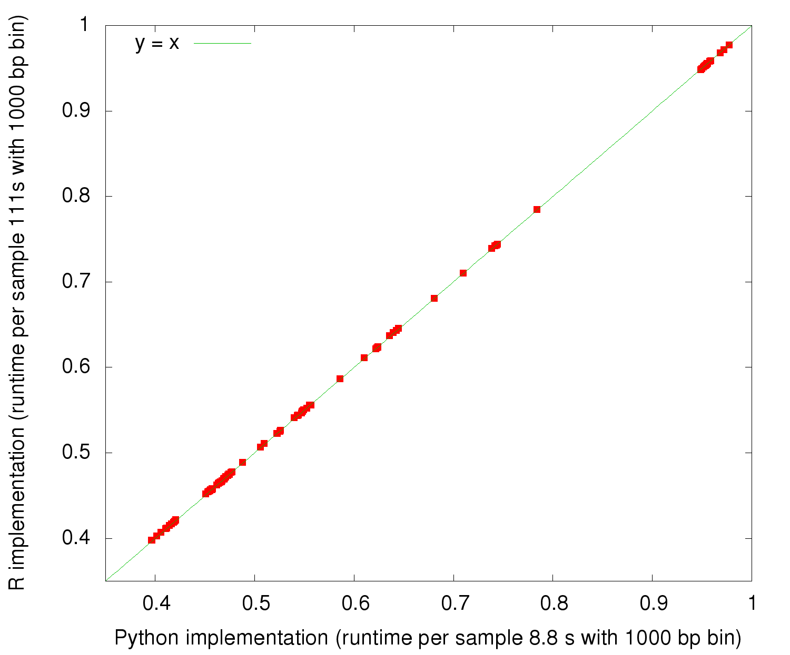

# hicrep

Python implementation of the HiCRep: a stratum-adjusted correlation coefficient (SCC) for Hi-C data with support for Cooler sparse contact matrices

The algorithm is published in 

HiCRep: assessing the reproducibility of Hi-C data using a stratum-adjusted correlation coefficient. Tao Yang Feipeng Zhang Galip Gürkan Yardımcı Fan Song Ross C. Hardison William Stafford Noble Feng Yue and Qunhua Li, Genome Res. 2017 Nov;27(11):1939-1949. doi: 10.1101/gr.220640.117. 

This implementation takes a pair of Hi-C data sets in Cooler format (.cool for single binsize or .mcool multiple binsizes) and compute the HiCRep SCC scores for each pair of chromosomes between the two data sets.

The HiCRep SCC computed from this implementaion is consistent with the original R implementaion (https://github.com/MonkeyLB/hicrep/) and it's more than 10x faster than the R version:



### Usage

To use as a python module, install the package 

```
pip install hicrep
```

and then use the util function `readMcool`

```python
from hicrep.utils import readMcool
```

to read a pair of `mcool` files and specify the bin size to compute SCC with:

```python
fmcool1 = "mydata1.mcool"
fmcool2 = "mydata2.mcool"
binSize = 100000
cool1, binSize1 = readMcool(fmcool1, binSize)
cool2, binSize2 = readMcool(fmcool2, binSize)
```

or a pair of `.cool` files with built-in bin size:

```python
fcool1 = "mydata1.cool"
fcool2 = "mydata2.cool"
cool1, binSize1 = readMcool(fmcool1, -1)
cool2, binSize2 = readMcool(fmcool2, -1)
# binSize1 and binSize2 will be set to the bin size built in the cool file
binSize = binSize1
```

then define the parameters for computing HiCRep SCC:

```python
from hicrep import hicrepSCC

# smoothing window half-size
h = 1

# maximal genomic distance to include in the calculation
dBPMax = 500000
dMax = dBPMax // binSize + 1

# whether to perform down-sampling or not 
# if set True, it will bootstrap the data set # with larger contact counts to
the same number of contacts as in the other data set; otherwise, the contact 
# matrices will be normalized by the respective total number of contacts
bDownSample = False

# compute the SCC score
# this will result in a SCC score for each chromosome available in the data set
scc = hicrepSCC(cool1, cool2, h, dMax, bDownSample)

```

To use as a command line tool, install this package by
```
pip install hicrep
```
then run 
```
hicrep mydata1.mcool mydata2.mcool outputSCC.txt --binSize 100000 --h 1 --dBPMax 500000 
```
or 
```
hicrep mydata1.cool mydata2.cool outputSCC.txt --h 1 --dBPMax 500000 
```
To see the list of command line options:
```
hicrep -h
```
